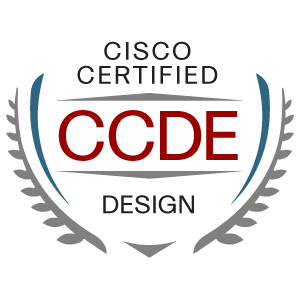
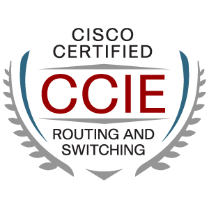
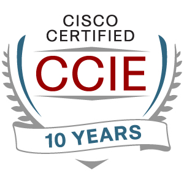
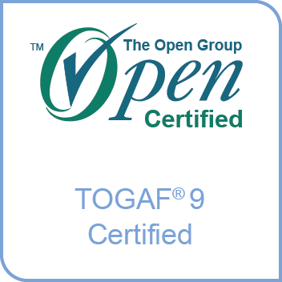
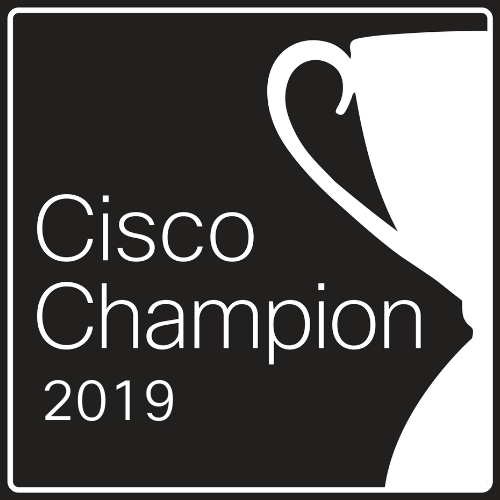
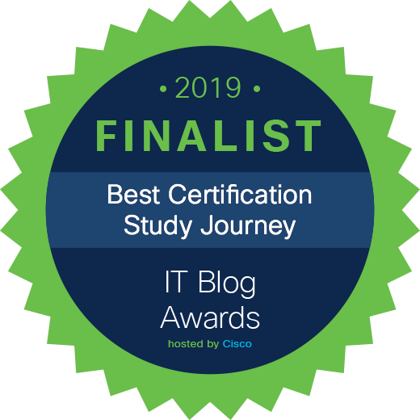

---
Welcome to my site. My name is Bruno Wollmann, and I'll be your host in this corner of the Internet.

## PROFESSIONAL INFORMATION

I’ve been in the Information Technology (IT) industry for over 20 years, with most of my roles revolving around computer networking in some form or another (i.e., design, architecture, implementation, support, and troubleshooting). Other positions I’ve held have been in sales, training, software development, desktop support and server administration. I'm currently self-employed and have been for more than half of my career.

Since graduating from the University of Regina with a Bachelor of Science in Computer Science, I've continually added to my knowledge and skills by working on many challenging projects and attaining many industry-recognized certifications. The most significant of these certifications are Cisco Certified Design Expert (CCDE #20190002), Cisco Certified Internetwork Expert (CCIE #19817) and The Open Group Architecture Framework (TOGAF). I place a high value on knowledge and use certifications as one type of motivator to gain that knowledge.

In addition to designing, architecting and implementing network solutions, I also love troubleshooting networks and applications. Any day I get to perform packet analysis is a good day - at least it's a good day for me 😉

## SITE INFORMATION

I’ve created this site as a way for me to connect to the larger, worldwide community of IT and networking professionals that exist both inside and outside the [Land of Living Skies](https://www.tourismsaskatchewan.com/) (Saskatchewan, CANADA).

In addition to learning from my own experience, because of the generosity of many active members of this community, I’ve had the opportunity to learn from others' experience, and I would be remiss to not also add to the knowledge base of this community.

A common thread through all the roles I've held in my career is that there's always been a requirement to write in one capacity or another, whether it be for documentation, training, knowledge transfer, proposals or design documents. Thorough research produces thoughtful writing, and I always research my topics before committing my thoughts to a record. I welcome your feedback, whether or not you agree with these thoughts.

This site will act as a repository for my notes, it will document my certification journeys, I will share my professional experience, knowledge and anything else I think will be helpful to the community.

## PERSONAL INFORMATION

I'm a farm boy from Saskatchewan, although no one believes that because I've never played hockey. I found computers at the age of 11 and was instantly hooked. I bought my first computer when I was in grade 9, a TRS-80, and never thought about anything other than a career in IT from that point forward.

When I'm not in front of a computer, I can usually be found outdoors with the most important people in my life, pictured above. We like to hike, ski, bike, walk, explore, camp, play games, fish and generally be goofy.

---

---
