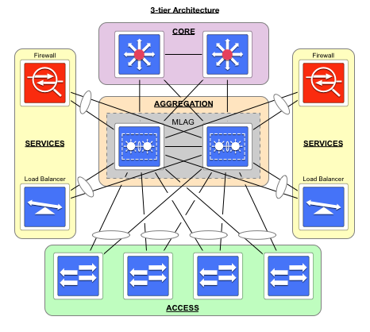
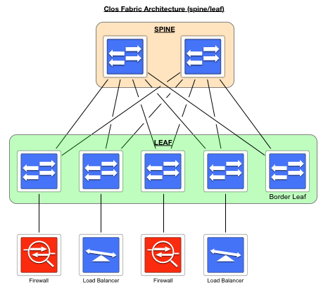

---

Surprise, it's not random


I've been on numerous data centre design projects over the last several years. Although there are many similarities between these projects, service placement is always present and is the subject of this post.

There are many ways to design a data centre network, but the most common designs use either a 3-tier architecture or a Clos fabric architecture (i.e., spine/leaf). The differences between a 3-tier design and a Clos fabric boil down to two key points when placing services such as load balancers and firewalls.

## Point 1: Oversubscription

3-tier data centre networks traditionally contain some level of oversubscription between the access and distribution/aggregation layers. Clos fabrics are designed without oversubscription and are, therefore, non-blocking.

If your services are attached to the access layer in a 3-tier design, their traffic would have to compete with traffic from other access-layer devices across oversubscribed links. This service placement wouldn't be a good design for centralized services.

In a Clos fabric, these same services can attach to any leaf switch(es), as the competition for bandwidth shouldn't exist. If it does, add more spine switches.

## Point 2: North/South vs East/West

Depending on your applications, traffic patterns have shifted from mainly North/South to more East/West.

In either case, these traffic patterns shouldn't affect a Clos fabric as every leaf switch has access to the same bandwidth as every other leaf switch, and there should be no oversubscription for this bandwidth. Again, add more spine switches if there is.

With a 3-tier design, placing services on the access layer would probably create a hot spot in your DC network, forcing you to increase the bandwidth to one (or a pair of) access-layer switch(es). Link aggregation or increased port speeds are two methods to increase bandwidth, but now you have a one-off case to deal with in your DC. The hot spot would occur no matter the traffic flow pattern. However, if most of your traffic is North/South, why put these services at the south end of your DC network when they could be placed more centrally in the distribution/aggregation layer?

## Do you see what I see?

Here is the picture I have in my head when discussing 3-tier architectures.

Here is the picture I have in my head when discussing Clos Fabrics.

## P.S.

If you modelled your data centre network following the 3-tier design, you should consider deploying a Clos fabric during the next refresh.

---
