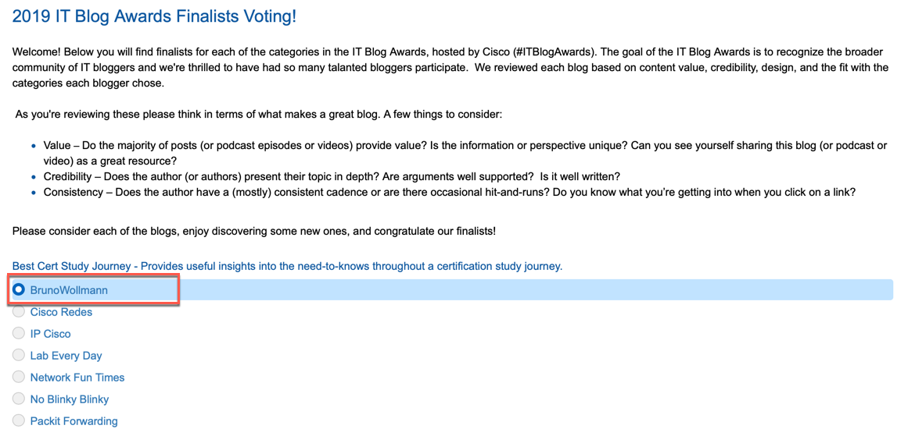

---
For the second year in a row, Cisco is hosting an [IT Blog Awards](https://www.cisco.com/c/en/us/training-events/events-webinars/influencer-hub/blog-awards.html/) to show their appreciation for the impact independent tech bloggers have on the community. It is Cisco's way of recognizing this great community for the passion, creativity and expertise they share throughout the year. There are 6 categories of blogs being recognized:

- Best Analysis
- Best Certification Study Journey
- Best Newcomer
- Best Podcast or Video Series
- Most Educational
- Most Inspirational

I'm proud to announce that [the post regarding my CCDE journey](https://brunowollmann.com/2019/05/my-ccde-journey-part-1/) is a finalist for Best Certification Study Journey.

<figure class="aligncenter size-medium"></figure>

If you found this post to be helpful to you, or you generally like it, please consider [voting](https://www.ciscofeedback.vovici.com/se/705E3ECD18791A68/) for me. Here is a screenshot of the voting page. Voting closes on December 13.

Thank you for your time and consideration.

---
