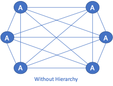
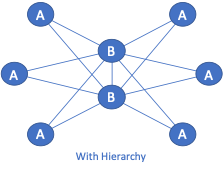
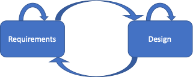

---
Following [Gathering Requirements](), Design is Next in this Back to Basics series. While the requirements reveal **why** the network will be built, the design shows **what** will be built.

ACME Corporation is large enough, and this project is high-profile enough, to warrant a design team rather than having a single network architect responsible for the entire design. Additional team members are one junior network architect, one network operations resource, one security resource, and one business analyst. Resources from various application teams, as well as other infrastructure teams, will be consulted as required. Your responsibilities as a senior network architect are two-fold. One responsibility is to mentor the junior network architect. Your primary responsibility is to have the team create a network design that meets all mandatory requirements and as many optional requirements as possible, while staying within the constraints.

Let’s get started.

## The Deliverables

Significant projects at ACME are subject to extra scrutiny. For the design team, this means two documents are produced, presented to the project board, and approved before work can continue.

The first document is the high-level design. Commonly referred to as a conceptual design or macro design, this document provides an overview of the system. It contains block diagrams and is mostly nontechnical. This document provides stakeholders with an opportunity to visualize the system and provide feedback without causing excessive rework if the design team needs to make modifications.

The second document is the low-level design, commonly referred to as a detailed or micro design. This document is highly technical and includes all system components and their features. Once approved, a well-written low-level design is an essential input to the deployment phase of any project.

## The Design Process

Workshops and meetings with the design team are crucial to disseminating pertinent information to everyone. Brainstorming on whiteboards or smartboards allows everyone to contribute to each document. Because everyone on the team needs to be creative, allow time for them to find their inspiration. Some members will excel in a group setting, while others will make more progress on their own. Allow for varying degrees of both.

It takes imagination and creativity to produce a network design that meets business, application, legal, technical, and security requirements while being bound by various constraints. While it might be possible to implement a cookie-cutter design from a favourite vendor, often, customizations are needed. So, where does one go for inspiration? Allow yourself to be distracted by some mindless physical activity. Go for a walk or a run, mow your lawn, shovel snow, take a shower. All these activities offer the brain a distraction and a break from being fixated on the problem.

## Design Considerations

The goal of the network is to meet business requirements. These requirements usually boil down to characteristics that are commonly considered in all network designs.

- Availability
  - While network availability is an industry term and a measurable metric, the business only cares about availability in the most general sense. Are the critical applications available when needed? The design needs to account for the required level of reliability (accounting for failures), availability (accounting for failures and planned maintenance) and resiliency (ability to provide an acceptable level of service during a fault).
- Scalability
  - How much and how fast will the network grow in the future? Scalability is commonly achieved through a combination of hierarchy and modularity.
  - Hierarchy
  - One need look no further than a corporate structure to see how hierarchy adds scalability to a system. ACME Corporation has 10,000 employees. Without hierarchy in the organizational structure, Porky Pig, the CEO, would have 9,999 direct reports. Since no CEO can scale to that level, 14 vice presidents report directly to Porky. Each of these VPs also has a small collection of direct reports that adds another layer of hierarchy and scalability.
  - This same principle applies to networks as well. In the figure “Without Hierarchy”, each A node has five connections, 1 to each of the other A nodes. If an additional A node is needed in the future, all other A nodes need to be modified. In the figure “With Hierarchy”, the B nodes add a level of hierarchy to the network. Adding an A node in this network means that only the B nodes need to be modified. A hierarchical network is more scalable than a network without hierarchy.

- Modularity
  - Turning back to the corporate structure for a moment, one can see modularity across business divisions as well as within these divisions. A VP heads each business division. Under each VP is a layer of Executive Directors (ED). Under each ED is a layer of managers. Under each manager is a layer of team leaders who, in turn, have regular employees as direct reports. One or more modules of this structure could be added easily if new lines of business are created or existing ones are expanded.
  - Similarly, modularity in networking provides simple building blocks that, when combined, create networks that can scale by simply adding more of the same building blocks. In the diagrams above, the A and B nodes could represent individual network components. The A nodes could represent an aggregation block inside a data centre, while the B nodes could represent the cores. Expanding further, the A nodes could represent smaller points of presence (POPs) across a geographical area, while the B nodes represent larger POPs.

- Security
  - As a network will always be attacked at its weakest point, it’s essential to design for all three aspects of network security.
  - Data-plane security deals with network admission, encryption and firewalls. Because many applications provide various forms of security, data-plane security is generally not the sole responsibility of the network. 
  - Control-plane security addresses aspects such as routing protocol and first-hop redundancy protocol security.
  - Management-plane security concerns direct access to network devices and the systems that manage them.
- Manageability
  - Manageability is listed last for a good reason. It is vital to avoid operational selfishness when designing the network. The prime directive is to meet business requirements, as it does not matter how easy it is to manage the network if it does not meet these requirements. It is only after the network has done everything it can to ensure the business's success that ease of management and network operations are considered.
  - The exception to this is visibility toolsets. Health monitoring, capacity planning, logging, and packet-capture tools, to name a few, will go a long way toward supporting the business and its applications.

## Is There an Echo in Here?

The goal of the design phase is to produce an approved low-level design document. Several iterations through high-level and then low-level workshops and meetings are all meant to fine-tune each document. It is rare to get everything correct on the first pass.

With that in mind, be prepared to return to the Gathering Requirements phase to clarify the requirements. Something that didn’t make sense when first heard may start to make sense after it’s echoed a few times.

Rather than a waterfall approach or a straight line through the phases, expect the paths to be well-worn in both directions and resemble the diagram below.

 
Now that we have an approved low-level design document, check back for the next post in this Back to Basics series, where we’ll discuss the deployment.

---
