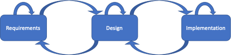

---

Mission execution


This post on network implementation is the third in my Back to Basics series. The first post, [Gathering Requirements](), focuses on **why** the network is built. The second, [Network Design](), focuses on **what** is built. This one focuses on **how** the network is built.

The goal of ACME Corporation’s data centre migration project is to migrate all existing applications and services from the existing data centre to a new one. To accomplish this, a few tasks with deliverables exist in this phase of the project.

## Build

The low-level design document has been completed and approved. Now it’s time to collect the final information so that network configurations may be created and installed on the network gear. This final information, which includes physical connectivity, IP addressing, and naming and numbering conventions, is collected into one or more repositories.

The physical connectivity information is used to create the cabling requests for the rack-and-stack team. It’s also used to build a detailed physical diagram. The logical information (i.e., IP addressing, naming and numbering conventions) is used to create multiple logical diagrams. Depending on the design's complexity, separate diagrams may be needed to display underlays, overlays, and the routing setup.

While diagrams are being created, configuration templates are being developed as well. During a lookup in the appropriate repository, the final information is substituted for variables in these templates. The templates are created to match the smallest modules identified during the project's design phase. The goals are consistency, reusability and repeatability. The templates create small snippets of configuration that are quick to apply and easy to troubleshoot if verification steps fail.

ACME Corporation has yet to adopt the latest network automation and orchestration techniques. As such, Microsoft Excel is used for both the information repositories and configuration templates. Using formulas and input validation, the build team has an excellent track record of producing reliable results.

## Test

ACME’s new data centre network was built to support a set of business requirements that translated to technical requirements. Although there are many others, technical requirements include throughput, latency, error rate, and failover times. The only way to verify that the network fulfills these requirements is to test it.

The network was designed and built from the ground up. Network testing should follow the same pattern, first verifying the health of each network component. Does everything power on correctly? Are there errors in any of the Power-On Self-Tests (POST) or device logs? Are the correct physical interfaces attached?

Moving from layer 1 to layer 2, what features (i.e., spanning tree, Multi-chassis Link Aggregation) are being used, and are they operating as expected? Using a traffic generator to simulate multiple hosts, is the network learning Media Access Control (MAC) addresses?

At layer 3, are the correct IP addresses configured and able to communicate with each other? Does the routing protocol show the expected neighbour relationships? Does the routing table show all desired routes?

Using specialized network test equipment is the best way to test for errors, latency, throughput and failover times, especially if the requirements call for a highly resilient network. Networks with less stringent requirements may be able to use workstations and laptops to perform adequate testing.

All results should be recorded in a document and saved as baselines for comparison with future test results. Once updated, this document should be accepted, approved and signed to confirm a successful build.

## Integration

The new network meets business requirements, but it is still isolated and therefore unusable in its current state. The next step is to connect it to the rest of ACME’s network so service migrations can commence.

ACME requires three types of connectivity to integrate the new data centre.

1. This data centre needs to connect to the existing Wide Area Network (WAN) to support all internal corporate users.
2. Internet connectivity is required to support remote access users, partner connectivity, and general Internet access.
3. A Data Centre Interconnect (DCI) is the dedicated path for service migrations from the existing DC to the new DC.

ACME has an extensive change control process, and until now, hasn’t needed to be followed. Integrating the new data centre requires adherence to the process. Configuration changes require a peer review. The entire change requires a Method of Procedures (MOP) document that details all aspects of the change. Additional network diagrams are also required to display the integration and transition states. Many meetings occur to negotiate a change window.

During the change window, all three connectivity types are implemented and tested. It is essential to test these connections to ensure they meet all requirements. Results should be recorded in the testing document and signed off on to signal that service migrations can proceed.

## Decommissioning

Decommissioning an old network can carry as much risk as integrating a new one. To help mitigate this risk, the entire change order process is invoked for this step as well.

ACME has decided that there is no reason to delay decommissioning once the last service has been migrated. Decommissioning the network is on the critical path because this space is earmarked for another purpose.

Checking for stragglers is a must. All services should have already been migrated or decommissioned, but this needs to be verified. Verification steps may include the following.

- Clear port counters and check whether they stay at zero or increase.
- Check the MAC address and Address Resolution Protocol (ARP) tables for active hosts.
- Check the DCI for unexpected traffic.

Investigate all evidence indicating a service that may incur downtime due to network decommissioning.

Once it’s verified that the original data centre isn’t home to active services, execute the MOP.

## Got Iteration?

The goal of network implementation is to provide a working network and close out the project. In the last post, we discussed how requirements gathering and design could have iteration within themselves and between each other. The implementation phase also adds iteration, as seen in the figure below.

Problems can arise in any of the Build, Test and Integration phases of implementation. When this happens, there are three possibilities.

1. Iterate inside implementation until the problems are addressed.
2. Go back to the design phase to refine it, then proceed to implementation.
3. If going back to design doesn’t help, go back to clarify requirements, then back to design, then proceed to implementation.

If the problems require a visit to requirements gathering, it’s important not to go from requirements back to implementation without first going through design. Doing so would invalidate all design documents. All documentation is an essential artifact for this project and for future projects that may reference it.

ACME Corporation has a new data centre network. The next post discusses [network operations]().

---
