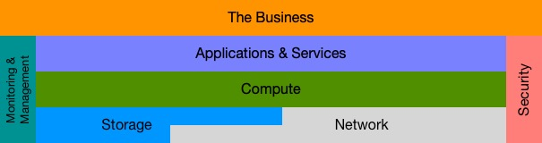

---

It's about the business


On February 13, 2019, I passed the [Cisco Certified Design Expert](https://learningnetwork.cisco.com/community/certifications/ccde/) exam to become [CCDE #20190002](https://www.credly.com/badges/a41d79f9-54ee-40be-b1ce-c194a14a5515/). This blog post series discusses the CCDE program and documents my certification journey. I have two purposes for these posts:

1. Encourage more people to pursue this worthwhile certification
2. Be of some assistance to those who have already decided to pursue CCDE

Part 1 of this series provides you with information about the program.<br>
[Part 2]() details the study materials I used, my study habits, and my timeline.<br>
[Part 3]() talks about the exam day and my strategies for the exam itself.

## Acknowledgments and Gratitude

I did not attain CCDE on my own, so before I go any further, I want to acknowledge and thank the many people who helped me. Some are aware that they helped, while others are not. They are all mentioned below.

The CCDE program would not be what it is without its program manager, [Elaine Lopes](https://twitter.com/elopes01/). She is the engine that powers the program, setting a high standard for those striving for this achievement.

Although I have never been in jail, at least not that you can prove, getting certified feels like breaking out of jail. It is the most challenging for the first few people to get over the wall, but once they do, a few stay at the top to lower a rope to assist those still in captivity. I will use subsequent posts to detail how they all helped, but for now, here is a list of people that helped pull me up: [Jeremy Filliben](https://www.jeremyfilliben.com/), [Martin Duggan](https://twitter.com/MartinCcie7942/), [Daniel Dib](https://lostintransit.se/), [Nick Russo](http://njrusmc.net/), [Łukasz Bromirski](https://twitter.com/LukaszBromirski/), [Piotr Jabłoński](https://www.linkedin.com/in/piotr-jablonski/), and [Piotr Matusiak](https://www.linkedin.com/in/pmatusiak/).

The following list contains the people in my study group. Sticking with the jailbreak theme, everyone in the study group pushes you up the wall while you desperately cling to the rope. Studying with [Remington Loose](https://localpref.net/), [Fareed Fakoor](https://twitter.com/cciepending/), [David Peñaloza](https://twitter.com/davidsamuelps/), [Ronald Lopez](https://twitter.com/rlopsa84/), [Jason Beltrame](https://twitter.com/jmbeltrame/), and [Alexander Aasen](https://www.linkedin.com/in/alexander-aasen-b0011aa1/) ensured my escape.

Friends, family, coworkers, and mentors were also critical to my success. We all have busy lives and wear many hats. We have many responsibilities and encounter a plethora of distractions that steal focus from our goals each day. Love, support, encouragement, and hope were always given freely to help me stay focused. While my most trusted mentor has been [Dwight Neirinck](https://www.linkedin.com/in/dwight-neirinck-19910a10/), I send the biggest thank you to [Diana Bye](https://www.dianabyeonline.com/), the mother of my children, the love of my life, and soon-to-be wife.

## Why CCDE?

Many people incorrectly assume that because someone is proficient at implementing and/or operating networks, they are also skilled at designing them. This thinking is equivalent to expecting any good driver to be able to develop a car for themselves. Assuming for a moment that this car makes its way from the drawing board to production, any sane driver is more likely to get a parking ticket than a speeding ticket. And so it goes with networking; having one skill does not imply that someone has the other. This implication is real even for a Cisco Certified Internetwork Expert (CCIE), as there is nothing in the CCIE program that teaches design theory, methodology, or skills.

Although a network may not carry the same type of precious cargo as your average grocery getter, the consequences of a poorly designed network can be wide-ranging and costly. I am sure we can all think of examples of some highly publicized network outages that affected thousands of people and cost those businesses millions of dollars in lost revenue or penalties. Enter the CCDE…

> **"The Cisco Certified Design Expert (CCDE) certification identifies networking professionals who have expert-level knowledge and skills in network design. CCDE certification emphasizes network design principles and theory at the infrastructure level. This prestigious credential recognizes the expertise of network designers who can support the increasingly complex networks of global organizations by effectively translating business strategies into evolutionary technical strategies."** - *CCDE webpage on the Cisco Learning Network website*

How important is your network to the business? What are the consequences of a poorly running network? What are the implications of a network outage? How does your network adapt to the changing needs of the business it supports? Is the network considered merely a cost centre or a strategic asset to the company? Because the network underpins all electronic services consumed by the business, an appropriate design is needed.



## Effective Network Design

Now that we have identified a few qualities of a CCDE, what are the characteristics of an effective network design? A network exists to support the flow of electronic data that is presented to it by the business. Therefore, any network that meets this goal can be said to have an effective design.

Q. Is it really that simple?

A. No.

In addition to supporting the business’s electronic data, other factors need consideration before a design can be considered adequate. This blog post lists many of the elements considered during the design process. Many tomes could be and already are dedicated to the following points. I will leave it as an exercise for you to research these points further.

- Cost
  - Always a factor
  - Return on Investment (ROI)
  - Capital Expenditure (CapEx)
  - Operational Expenditure (OpEx)
  - Total Cost of Ownership (TCO)
- Requirements and Constraints
  - What is the network’s reason for being?
  - Mandatory requirements
  - Requirements that would be nice to meet
  - Mandatory constraints
  - Business requirements and constraints
  - Technology requirements and constraints
  - Industry/legal compliance
- A slew of essential properties
  - Scalable
  - Modular
  - Flexible
  - Adaptable
  - Reliable
  - Resilient
  - Serviceable
  - Available
  - Manageable
  - Secure

## Oh, the Technology!

So far, we have talked about the qualities of a CCDE and the properties of effective network design. Let us spend some time talking about what technologies a network designer needs to know and the places in the network (PIN) where these technologies apply.

The “Cisco” in CCDE refers to who recognizes your expert design abilities. Except for a few proprietary protocols (i.e., EIGRP, DMVPN, and GETVPN), the CCDE exam is vendor agnostic. Do not spend your time researching and studying network equipment makes and models or how to configure them. You may need to lab some technology to understand how to design it, but for exam purposes, do not spend time memorizing, optimizing, or being efficient at the configuration.

Here are some of the technologies you need to know. It is not a comprehensive list, and technologies can be added or removed anytime. I apologize in advance for the acronym salad.

- Topologies
  - Hub and spoke
  - Ring
  - Full-mesh
  - Partial-mesh
- Routing
  - IGPs - EIGRP, OSPF & IS-IS
  - **BGP, BGP, BGP**
- Switching
  - VLANs
  - Spanning tree protocol
- VPNs
  - L2VPNs - L2TPv3, VPLS, VPWS
  - L3VPNs - MPLS
  - Tunneling - GRE, IPSEC
- IPv6
  - Enterprise and service provider usage
  - IPv4 to IPv6 transitions
  - Security
- Multicast
  - Enterprise (IP)
  - Service provider (MPLS)
- QoS
  - Layer 2
  - Layer 2.5 - MPLS
  - Layer 3
- Virtualization
  - Overlays
  - Underlays
  - NFV
- Fast Convergence
  - MPLS-TE
  - FRR
  - LFA
  - BFD
  - Fast hellos
- Security
  - Network Infrastructure
  - Control plane
  - DOS
  - Spoofing
  - Firewalls
  - Encryption
- Evolving Technologies
  - IoT
  - Cloud
- Management & Monitoring
  - SNMP
  - SLA
  - IPFIX
  - NetFlow
  - Logging

The above list certainly seems daunting, and I can confirm it is. I spent about two years studying these technologies in addition to my 20 years in the networking industry. The list is daunting and achievable at the same time.

As for where these technologies apply, any place that needs a network is fair game. Here is a short list:

- Enterprise
  - Head office
  - Branch office
  - Campus
  - Data Centre
  - Internet Edge
  - Service provider handoff
- Service provider
  - Enterprise customer peering
  - Personal customer peering
  - WAN (regional, national, global)
  - Peering points to other service providers
  - Points-of-presence
- Mobility

## How Do You Get It?

Attaining CCDE is a two-step process. For me, it was about a two-year, two-step process.

### Step One: CCDE Written Exam

The first step is passing the CCDE written exam. It is a closed-book qualification exam with 120 minutes to answer between 90 and 110 questions. It has been designed to test your combined knowledge of routing protocols, internetworking theory, and design principles.

The topics on the written exam fit into five general categories that are weighted as follows:

1. Layer 2 Control Plane (24%)
2. Layer 3 Control Plane (33%)
3. Network Virtualization (15%)
4. Design Considerations (18%)
5. Evolving Technologies (10%)

Product-specific knowledge, such as code versions and commands, is not tested. Not having switch models and their corresponding interface queuing setup take up space in your brain is helpful. You can take solace in the fact that you will not see 1P2Q1T or any variants on this exam. This information is useful for implementation and operations but is not in the designer's purview.

### Step Two: CCDE Practical Exam

The second step is where you get to show what you are made of. You are tortured by an 8-hour exam that tests your ability to identify, analyze, optimize, manage, and create advanced solutions for large-scale networks. During this solitary confinement, the exam presents four challenging network design scenarios. Complicating each scenario is the fact that you are dealing with “real-life, production” networks. At no time during the exam will you design a greenfield system where you can regurgitate industry best practices all the way to the CCDE hall of fame. Real-life networks are messy and complicated. So are the networks in the exam.

Exam day is divided into three parts:

1. Scenario 1 is immediately followed by scenario 2 (4 hours)
2. Lunch (1 hour)
3. Scenario 3 is immediately followed by scenario 4 (4 hours)

The topics on the practical exam fit into four general categories that are weighted as follows:

1. Analyze Design Requirements (36%)
2. Develop Network Designs (39%)
3. Implement Network Design (13%)
4. Validate and Optimize Network Design (12%)

As with the written exam, the practical exam is almost wholly vendor agnostic. You do not need to know configuration commands or network equipment model names and numbers.

#### Scenario Documentation:

Networking would be so much easier if not for business requirements and user expectations, and each of the 4 test scenarios has plenty of both. Each scenario starts by providing documentation that sets the stage for your design challenge. As you progress through a scenario, more documentation and new information are provided in the form of emails, memos, SMS, chat, etc. Further information can be presented after every few questions or as frequently as after every question. The key is to read through it quickly and glean all relevant information. The clock is ticking while you absorb this information, so you want to minimize your rereads. I will talk about my strategy in a future post.

Here is some of the documentation you may see:

- Company profile (there may be more than one company in the scenario)
  - Enterprise, service provider or both
  - Geography (regional, national, global)
  - Applications and services
- Your responsibilities (may change throughout the scenario)
  - Lead designer or advisor
  - Which company you are designing for
- Use case (1 or more of the following — usually more)
  - Replace technology
  - Add technology
  - Merger/acquisition/divestiture
  - Design failure (fix the broken design)
  - Scaling (You need a bigger boat)
- Network documentation (some or all of the following with varying degrees of detail)
  - Speeds and feeds
  - Number of users
  - Diagrams
  - Addressing plan
- Requirements and constraints
  - Business
  - Application
  - Operational
  - Financial
  - Technological

This exam tries to simulate a network designer's everyday, real-life interactions with their business. Have you ever received complete, clear, and concise business and application requirements in a tabular format that you can use to design an appropriate network? Neither have I, and you will not receive them on the exam either. Gathering network requirements in real life is part interpolation, part extrapolation, part experience, part clairvoyance, and many hours of design workshops and conversations. You will need to wade through what seems like mutually exclusive requirements, mutually exclusive constraints, as well as requirements and constraints that seem to contradict each other.

Your most significant assets for all the documentation are:

- Ability to read quickly
- Ability to skim through the documentation
- Ability to connect with the scenario
- Ability to understand what it is you are trying to accomplish
- Ability to quickly identify pertinent information
- Ability to promptly identify irrelevant information
- A method to catalogue important information for rereads (unless you have an eidetic memory)

#### Question Formats:

No exam would be complete without its questions, and this exam has more than its share of difficult ones. Each scenario contains 25 to 35 of the following question types.

- Choose the best answer
  - Click only one of the multiple radio buttons
- Choose multiple answers
  - Check the appropriate number of boxes
  - The test engine will not let you proceed if you have not selected the correct number
- Drag and drop
  - There is an unordered list of tasks in the left column
  - Drag them to the column on the right, placing them in the proper order
  - Sometimes there are more options on the left than available spots on the right
- Matrix (widow-makers)
  - Place a checkmark in all the cells that satisfy a particular condition
  - The conditions might be technology related
  - The conditions might be requirements related
- Diagramming
  - There are several variations of diagramming questions
  - Drag and drop network gear to complete a diagram
  - Draw links, circuits, and tunnels to complete a diagram
  - Point to the root cause of a problem
  - Choose the best diagram
  - I found these questions to be time-consuming. Everyone draws diagrams using their style. It took me time to orient myself to each diagram and erase the picture I had already drawn in my head.
- Branching
  - These types of questions can take any of the above forms
  - A follow-up question usually meant for you to justify your decision(s) in the previous question
  - I suspect these are a way to identify and remove points for lucky guesses

There are several critical points to remember while progressing through the exam. The first point is that once you complete a scenario, you cannot return to it later in the day. The second point is that you cannot go back to a previous question inside a scenario. Therefore, you must answer each question to the best of your ability before advancing to the next question. The last point is that you can leave comments on each question, and the CCDE team at Cisco will read them. However, the clock keeps ticking while you are leaving these comments.

## Who You Gonna Call?

Not only does having a CCDE demonstrate that you have deep knowledge of many technologies, but it also demonstrates that you know when and where to best use these technologies. You know when and where `not` to use certain technologies. You know how to put business requirements front and centre without breaking the bank or compromising operations and supportability.

Here is a little song that is sung to the tune of "Ghostbusters" by Ray Parker Jr.

```text
If there’s somethin’ strange in your network neighbourhood
Who ya gonna call? A CCDE!
If there’s somethin’ weird and your design don’t look good
Who ya gonna call? A CCDE!

I ain’t afraid of no networks
I ain’t afraid of no technology

If you’re seein’ things not running on time
Who can you call? A CCDE!
If your network troubles are starting to climb
Who can you call? A CCDE!

I ain’t afraid of no requirements
I ain’t afraid of no constraints
```

Although I hesitate to call myself an expert, since learning never stops, I will point out that I can learn anything and effectively apply that knowledge. Let me know how I can help you with your network design challenges. You can call this CCDE [here](https://brunowollmann.com/contact/).

## What's next for you?

Are you studying for any certifications? Which one(s)?

Are you planning to be a CCDE? When? Let me know if I can help.

---
