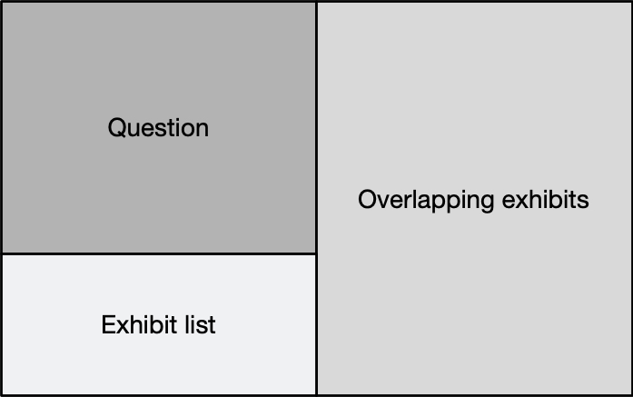

---
You have found the third and final installment in the series that documents my CCDE journey. This post is all about exam day.

[Part 1]() provides information about the program. 
[Part 2]() reveals the study materials I used, my study habits, and the timeline.

## The Lead-up

> **We don't rise to the level of our expectations; we fall to the level of our training.** - *Archilochus*

With my exam date fast approaching, I stopped studying on the night of Saturday, February 9. I spent Sunday with my family, while Monday was a regular workday. The testing centre is in a city (Saskatoon, SK), about a 2.5-hour drive from my home, so I booked meetings with customers in Saskatoon on Tuesday and drove up in the morning.

It’s challenging to stop studying a few days before an exam for which you’ve sacrificed so much. There is always more to learn. When is enough enough? However, stopping studying is imperative for me. My brain needs ample rest to be at its best for the actual test. This rest increases creativity and alertness, staving off boredom, carelessness, and fatigue during an 8-hour marathon. You need mental stamina to pass the CCDE.

To help amplify my mental stamina, I needed to ensure I ate a good meal and had a restful sleep the night before the exam. Some physical activity was in order. I embarked on a 30-minute walk to a great Thai restaurant. After a fantastic meal, I took about 45 minutes to walk back to my hotel. February in Saskatchewan is usually pretty cold. February 12, 2019, didn’t disappoint. It was approximately -32 °C at the time of my walk. The food, the frozen air, and the brisk pace did the trick. I slept like a baby.

In the morning, I ate a good breakfast. I love my morning coffee but abstained because of its diuretic effects. An aching bladder would not chew up any of my precious exam time or steal focus from the tasks at hand.

## The Testing Centre

Although I had been at this testing centre once before, I visited it the day before my exam to make sure there were no surprises (i.e., detours, closed parking lots, busted elevators, etc.) that would cause me to be late.

On the day of my exam, I arrived at the testing facility about 20 minutes early to give me time to complete the sign-in procedures.

---
> At all testing centers, Cisco requires the capture of your photograph and digital signature. Please be prepared to show two forms of personal identification. Your name must match on both, and both must have your signature, and one must be a valid, government-issued picture ID. Expired IDs are not valid.
---

Once I placed all my personal belongings in my locker, the proctor escorted me to the testing area. Before entering the test room, I was required to pat myself down, turn my pockets inside out, and put my reading glasses in a place where they could be analyzed. This process took about a minute and was captured on video. This exact procedure is followed every time you need to leave and reenter.

## The Test Experience

I was escorted to my testing station by a proctor. Once I sat in front of the 22-ish inch monitor, the proctor supplied me with an 8” x 11” dry-erase board and marker. She then told me I was not to erase anything from the board. If I needed more space, I was to hold up my hand, and she would exchange it with a clean one. She then logged onto the testing system, verified the correct test loaded for me, and went to the spot where she could monitor me for the next eight hours.

Once the test started, I used the following layout for the majority of the exam:

I tried to keep the question and the exhibit list visible at all times. Overlapping the exhibits didn’t cause problems as I could quickly and easily switch between them using the exhibit list.

My system seemed to freeze several times throughout the day when advancing from one question to the next. This delay caused me a little bit of concern as I thought precious seconds were ticking away during this time. A glance at the countdown timer on the screen removed all panic. The timer stopped until the next question, and all open exhibits were fully rendered.

## Testing Advice

- **Connect** with each scenario to create context. Try to visualize your role in each scenario to help build that context. If an exhibit describes you talking to someone about requirements, paint a mental picture of what that person looks like. Visualize sitting across a desk or table from them.

- **Laser focus** on each question. Read each one carefully and only answer what is asked. Don’t read anything that isn’t there, and don’t play the what-if game with yourself. Overanalyzing can waste time, cause mental paralysis, and lead to choosing the wrong answers.

- **Pay special attention** to diagrams, as I found these to be especially tricky. While reading the documentation, I would create mental pictures. Without fail, these pictures were different from the diagrams provided in the exhibits. In many cases, my diagrams were correct, but they were different enough from the exam’s diagrams that it took a little bit of effort to reorient myself.

- **If a question has you stumped**, that’s ok. It probably will happen. Stay calm and take a deep breath or two. You already know the technical aspect of the scenario; you just need to choose the best answer based on the given requirements and constraints. You probably missed something in the documents. Go back and find it, but don't waste time.

- **Be confident** with your decisions. Don't let the exam throw you off your game. Sometimes you will pick the best answer, but the exam takes you in a different direction. How often have you presented a great design to a customer only to have them choose something totally different and suboptimal? Draw on that experience, trust yourself, and roll with it in the exam.

- **Answer each question** to the best of your ability, as there is no going back to that question. This advice is especially crucial if your confidence starts to wane. You may be doing better than you think, so stick to your process until the end.

- **Take a short break** between each scenario. Five minutes should be enough. Go to the bathroom. Have a drink of water. Erase everything in the previous scenario from your mind. Take advantage of the [doorway effect](https://www.scientificamerican.com/article/why-walking-through-doorway-makes-you-forget/). Remember that the clock is still running, and you must go through the (re)entry procedure to get back into the test room.

- **Take the full hour** for the lunch break. There is no banking time, so a short lunch break buys you nothing. Use the hour to rest your brain for the final push.

- **After the test**, document everything you can remember about your experience. It takes 10 to 12 weeks to get your results. Use this time to improve your weaker technology areas. More importantly, use this time to work on your exam-taking strategies. Let your experience guide you.

## It Depends

Some common questions I get asked about the exam are:

- “How much scenario documentation is there?”
- “How fast did you have to read?”
- “Are you a fast reader?”

There is indeed quite a pile of documentation to absorb for each scenario. Getting through it and picking out the essential details while discarding the irrelevant parts is one of the keys to success. Success isn’t necessarily based on how fast you can read. It’s about reading comprehension and retention. You can read slower if your retention and comprehension are such that you only need to read something once. You need to be a faster reader if your retention and comprehension are suboptimal on the first pass, forcing you to reread certain documents. You need to know your strengths and weaknesses in this area.

There are three tools available during the exam to help keep track of information:

1. The test engine has an electronic notepad built into it, which I didn’t use at all.
2. The supplied dry-erase board and marker, which I used a little bit.
3. The test engine has a multi-coloured highlighting function that you can use to mark up the exhibits. For simplicity, I used a single colour to highlight important details in each scenario.

I know people who have passed the exam who didn’t take a single note and didn’t highlight anything. Only you know what will work best for you.

## Final Thoughts

When I passed my CCIE exam, I was 100% sure I passed, and an email confirmed it in less than 12 hours. I wasn’t nearly as confident about my CCDE exam. If I’m honest, I thought it could’ve gone either way. I got my results after an excruciating nine weeks. I kept studying during the wait in case I failed.

There’s always a certain amount of subjectivity during the network design process. The ability to glean requirements and constraints from documents, emails, instant messages, meetings, and conversations is a valuable skill. Matching the proper technology with these requirements and constraints is THE skill the CCDE tries to identify in its candidates.

**Do you have this skill? 
Do you have what it takes to become a CCDE?**

As I write this post, there are less than 500 Cisco Certified Design Experts worldwide. My wish is for you to become the next one.

---
