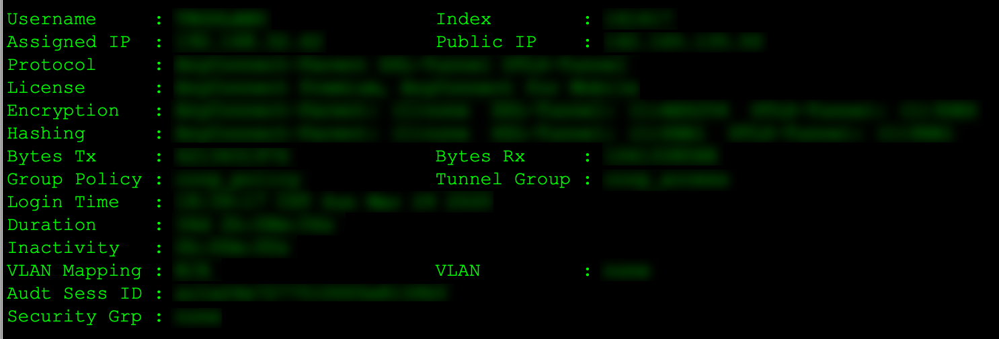

---

This is the way. One of them, at least.


As with many other networking professionals around the globe, Covid-19 caused me to drop all projects to design and deploy augmentations to remote access VPN solutions for my customers. Implementations of new Cisco ASA firewalls were fast and successful, but the work did not stop there.

This post shares how I used network automation tools to accelerate data collection and manipulation for operating and troubleshooting the old and the new VPN environments.

All code lives in its [GitHub repository](https://github.com/wollmannbruno/QuickWins/tree/master/CiscoASA/). It definitely helped me. Hopefully, it will help you too. I'll disclose that this is only the second Python program I have ever written. I'm all ears if you have suggestions for improving some logic or code. I will happily use any criticism to improve my skills.

## The Old Way

In the early days of the massive transition to working from home, where wearing pants is discouraged, there were a host of reasons why the VPN session database had to be queried on both the old and new firewalls. If you have ever had to query this database, you should recognize the dizzying image below.

.

Without any filtering, fourteen lines of text are printed on the screen for every connected user. Depending on how many users are connected, you can expect tens of thousands or even hundreds of thousands of lines of output.

Often, some or all of this output is copied to Excel for further manipulation (i.e., additional filtering, sorting, grouping, etc.). However, before any manipulation can occur, the data needs to be cleansed. Cleansing the data is the process of identifying it and then freeing it from labels and whitespace - another tedious, manual process.

Decreasing efficiency even more, multiple network analysts could be performing this dance of madness at the same time.

## The New Way

This program was built with Python 3.7.7, but it should work with 3.6. Because of the use of f-Strings, it probably won't work on pre-3.6 systems.

[Netmiko](https://pypi.org/project/netmiko/) connects to devices, issues commands, and collects the output. [Openpyxl](https://pypi.org/project/openpyxl/) creates and manipulates an Excel workbook. Installation of both libraries is accomplished using the pip installer.

The combination of [NTC Templates](https://github.com/networktocode/ntc-templates/) and [TextFSM](https://pypi.org/project/textfsm/) converts the output collected by Netmiko from one large string into structured data (i.e., the cleansing part discussed in the previous section). TextFSM is installed during the Netmiko installation. The easiest way to install and use the NTC Templates is to `git clone` them to your home directory.

```python
from datetime import datetime
from getpass import getpass
from netmiko import ConnectHandler
from openpyxl import Workbook, load_workbook
from openpyxl.utils.cell import get_column_letter
from openpyxl.worksheet.table import Table
```

## main()

The main function is the hub of this program in that it calls all other functions.

- The first call is to obtain user credentials for the firewalls.
- The second call occurs inside a loop.
  - For each firewall, call the function that collects the VPN-session DB information.
  - Append the returned data to the results list.
- The final call is to place the collected information in an Excel spreadsheet.

---
> **NOTE:** You will need to modify the dictionaries to match your firewall inventory. Adding, removing, or changing the name of a dictionary also requires modification of the for loop.
---

### Future Improvements to main()

- Move the inventory to a separate file.
  - This program should not have to change when there is a simple change to the number of queried firewalls.
- The output returned from each device is appended to a list.
  - It probably makes more sense to store it in a dictionary instead, using the hostname as the key.
  - This would also require a logic change in the `output_to_excel()` function.

```python
def main():
    """
    The main() function has the following duties:
     - Contains the inventory of Cisco ASA firewalls to be queried.
     - Obtains the current date and time.
     - Calls a function to retrieve credentials for the firewalls.
     - Iterates through the inventory, calling a function to retieve the desired
       information.
     - Calls a function to save the information to a Microsoft Excel file.
    """

    username, password = get_creds()

    primary = {
        "device_type": "cisco_asa",
        "host": "fwl-dc1-vpn-a",
        "username": username,
        "password": password,
    }

    secondary = {
        "device_type": "cisco_asa",
        "host": "fwl-dc0-inet-a",
        "username": username,
        "password": password,
    }

    now = datetime.now()
    tab_name = now.strftime("%Y_%m_%d_%H_%M_%S")

    results = []
    for firewall in [primary, secondary]:
        results.append(firewall["host"])
        vpn_sessiondb = show_vpn_sessiondb(firewall)
        results.append(vpn_sessiondb)

    output_to_excel(tab_name, results)
    
if __name__ == "__main__":
    main()
```

## get_creds()

This function obtains credentials directly from user input. It also allows the user to quit the program gracefully by entering `q` or `Q` for either the username or password. This ability is helpful if a device rejects the credentials. If an invalid username or password is entered, the program calls this function until the correct credentials are entered.

### Future Improvements to get_creds()

- I wanted to condense the `if` statements to a single line, but all the linters raised style errors.

```python
def get_creds():
    """
    The get_creds() funtion queries the user for the username and password needed to
    logon to each firewall.
    """

    print("-" * 40)

    un = input("Username, (q) to quit: ")
    if un.lower() == "q":
        exit("QUITTING")
    pw = getpass()
    if pw.lower() == "q":
        exit("QUITTING")

    print("-" * 40)

    return (un, pw)
```

## show_vpn_sessiondb()

This function connects to the device and queries the VPN-session DB. It uses TextFSM and the NTC Templates to convert the output to structured data. It then returns the result to the `main()` function. If the program can not connect to the device, invalid user credentials are assumed, and the user is asked to re-enter credentials by calling `get_creds()` again.

### Future Improvements to show_vpn_sessiondb()

- Replace the bare exception with a proper exception type.
  - Invalid user credentials
  - Device unreachable/down
- Change the command sent to the firewalls from being hardcoded to being input by the user at runtime or read from a file.
  - Just about any command output should be able to be used by the other modules.
  - Change the name of the function to something more generic.

```python
def show_vpn_sessiondb(device):
    """
    The show_vpn_sessiondb() function uses Netmiko to connect to each firewall, and
    collect the output from the SHOW VPN-SESSIONDB ANYCONNECT command. It uses TextFSM
    from network.toCode() to convert the output from one large string to structured data.

    ARGS:
        device (Dictionary): Device information used by Netmiko.
    """

    done = False
    while not done:
        try:
            net_connect = ConnectHandler(**device)
            print(f"Gathering information from {device['host']}")
            done = True
        except:
            print("\n")
            print(f"ERROR: Invalid username or password for {device['host']}")
            username, password = get_creds()
            device["username"] = username
            device["password"] = password

    output = net_connect.send_command("show vpn-sessiondb anyconnect", use_textfsm=True)
    net_connect.disconnect()
    return output
```

## output_to_excel()

This function performs the bulk of the work in this program.

- Accepts the information from each device and saves it to a new tab in an Excel file.
  - If the file does not exist, create it.
  - Create a new tab in the first position.
  - The tab name is the date and time the program was initiated.
- The first row contains column headings.
  - The first column is the hostname
  - The remaining columns are the dictionary keys from the device output
- The remaining rows house the dictionary data.
  - The data is entered cell by cell.
- Once all data is entered, it is formatted as a table.
  - The table name is the date and time the program was initiated.
  - This allows for immediate filtering and sorting by column header.
- The file is saved.
- The program exits.

---
> **NOTE:** You will need to modify the PATH variable so the Excel file is saved in a directory that actually exists in your environment.
---

### Future Improvements to output_to_excel()

- Break it down into smaller functions.
  - It would be easier to read and more straightforward to follow.
- Remove dictionary ordering logic.
  - Because dictionaries are unordered, part of the logic is to ensure that the correct data is placed in the proper column. As of Python 3.7, dictionaries preserve the insertion order, making this code unnecessary.
  - However, doing so means less backward compatibility.
- I'm not sure it's a good idea to have the filename and path hardcoded into the program.
  - This information could easily be kept in a separate file or be input by the user at runtime.
- Replace the bare exception with a proper exception type or improved file handling logic.

```python
def output_to_excel(tab, data):
    """
    The output_to_excel() function saves information to a Microsoft Excel file.

    ARGS:
        tab (String): Current date and time used to create the tab name and the table
        name in the spreadsheet.

        data (List): The data saved to a spreadsheet.
    """

    PATH = r"S:\Cit\Operations\Network\AnyConnect"
    FILE = r"\AnyConnect.xlsx"
    excel_file = PATH + FILE

    try:
        wb = load_workbook(filename=excel_file)
    except:
        wb = Workbook()
        ws = wb.active
        wb.remove(ws)

    ws = wb.create_sheet(tab, 0)

    ws.cell(1, 1, "Firewall")
    column_number = {}
    # Using the first dictionary from the second item
    # in the list to generate the column headings
    headings = data[1][0].keys()
    number_of_columns = len(headings) + 1
    max_column = get_column_letter(number_of_columns)
    for element, heading in enumerate(headings, 2):
        # Populating the column header cells
        ws.cell(1, element, heading)
        # Creating a dictionary to store the column headers
        # with their column number because dictionaries are unordered
        column_number[heading] = element

    row_number = 1
    # Iterating through the list
    for item in data:
        if type(item) == str:
            hostname = item
        else:
            # Iterating through the list of dictionaries
            for row_data in item:
                row_number += 1
                # Populating the first cell in the row with the firewall name
                ws.cell(row_number, 1, hostname)
                for column_heading in headings:
                    # Populating the rest of the cells in the row by using
                    # a dictionary lookup where the column header is the key
                    ws.cell(
                        row_number,
                        column_number.get(column_heading),
                        row_data.get(column_heading),
                    )

    table_ref = f"A1:{max_column}{row_number}"
    table_name = f"_{tab}"
    vpn_table = Table(displayName=table_name, ref=table_ref)
    ws.add_table(vpn_table)
    ws.freeze_panes = "D2"
    wb.save(excel_file)
    print(f"Recorded {row_number} rows in spreadsheet {excel_file}")
```

## This is the Way

The data collection process for any problems related to AnyConnect remote access VPN is now fully automated. Once this program completes, the network analyst can immediately zero in on the desired data. The human has been freed from the monotony of manually converting walls of text to usable information. The pantless home worker is that much closer to having their problem solved.

Let me know if this program has helped you. Also, please stay safe and well during this crazy time.

---
