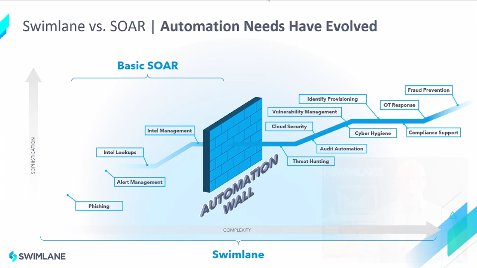
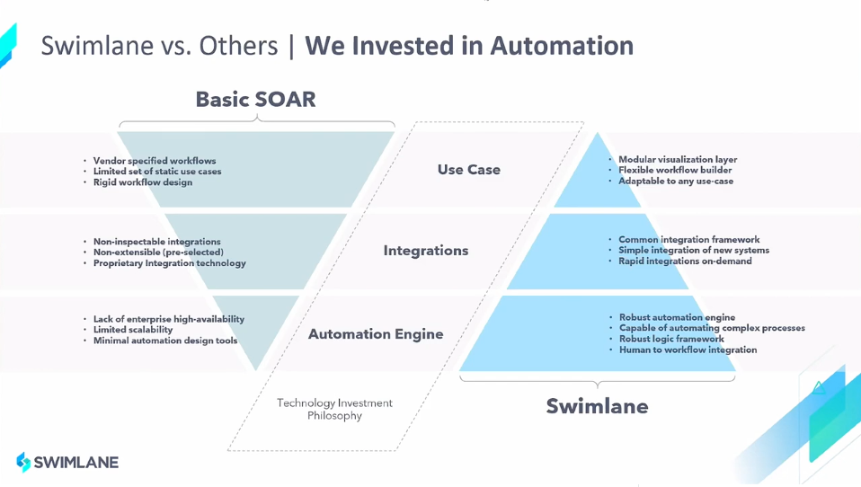
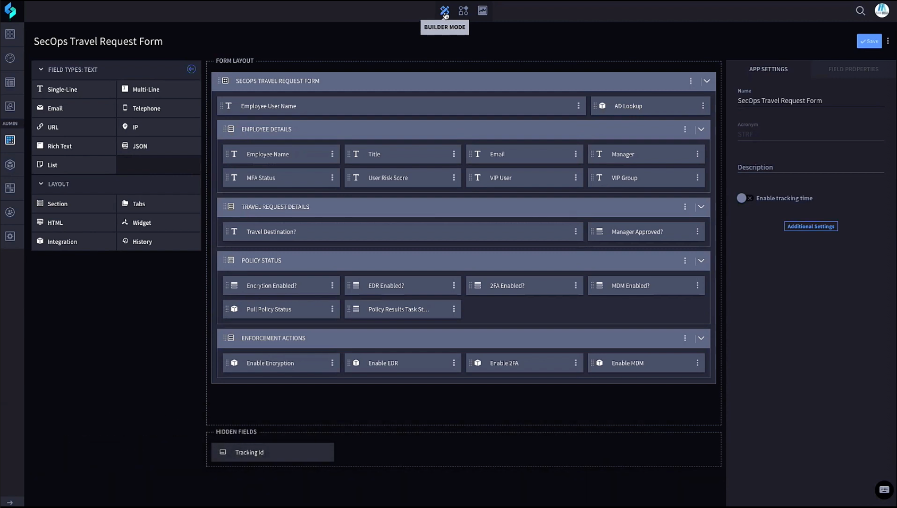
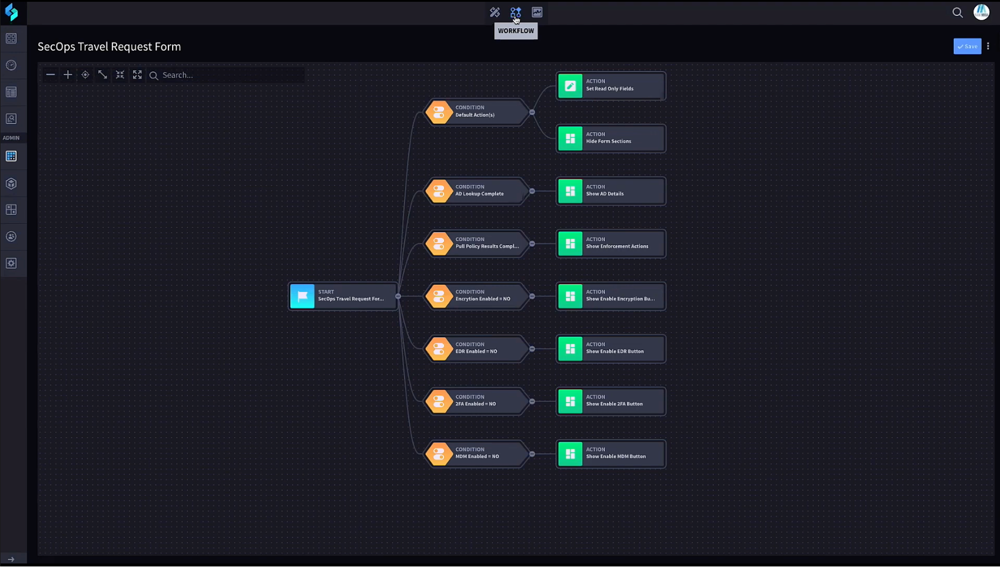

---
On October 21, 2021, representatives from Swimlane delivered a presentation at [Security Field Day 6](https://techfieldday.com/event/xfd6/). Cody Cornel and Byron Page [demonstrated](https://techfieldday.com/appearance/swimlane-presents-at-security-field-day-6) how their product is more than your typical Security Orchestration, Automation and Response (SOAR) system.

This post talks about three factors from that presentation that stood out for me.

## 1. But First, Security Automation

It seems that not a day goes by without hearing about some new cyber security breach of some high-profile business. Whether these attacks cause downtime, are meant to steal data, or hold data hostage for a ransom, the frequency of successful security attacks is increasing.

The traditional response to combat this growing problem has been to hire more SecOps people (which are extremely hard to find) and to buy more security tools (which leaves a team spending more time managing tools than combating threats). More security tools create more data, resulting in a narrower focus, leaving gaps in visibility and an inability to respond effectively.

To address the complexity caused by tool and data explosion, security teams started creating integrations between tools. This integration evolved into rudimentary automation and then to the present market of SOAR tools. The current crop of tools has limited and fixed use cases requiring code-heavy playbook development to extract additional functionality. They have hit a wall in what they can accomplish.

Swimlane's approach was to invest heavily in automation from the outset. The result is a system that can easily adapt to the ever-changing needs of your environment. The “easily” part comes from the low-code automation studio — [more about that later](#3-beyond-traditional-security). The “ever-changing” part requires simple integration to new systems and the ability to adjust to any use case.

Swimlane has a bench of developers constantly creating integrations to commercial products for free. This bench is one of the value adds to this system. In addition, if you have a set of reliable scripts you cannot do without, you can import them into Swimlane.

With a laser focus on automation, Swimlane has exposed its platform through a series of APIs. This exposure allows your developers to follow in-house development practices that should include version control, linting, approvals, and any other development workflows that exist in your shop.

## 2. All Of These Things Are Kind Of The Same

It is easy to comprehend that no two organizations do cyber security the same way. With differing security requirements come different rules, responses, and workflows. Sadly, when left to manual processes, no two security analysts do security the same way either, even when employed by the same organization.

A typical security analyst works with many tools throughout the day; SIEM, logging, threat intelligence feeds, vulnerability scanners, and intrusion prevention systems are just a few examples. Other necessary tools are ticketing systems, email, and instant messaging platforms. Is there any question as to why there would be variations in responses between security analysts?

Swimlane designed its platform to be the interface between the human and all of the tools mentioned above. Swimlane's automation consists of integrations across thousands and thousands of API endpoints across hundreds of unique tools. There are even integrations to some of the competition.

Swimlane ingests information from various security monitoring tools and consistently presents it to the security analyst, saving them from visiting each system separately. Case management, visualization, and reporting are all performed from inside the platform. The collaboration hub connects analysts to ticketing systems, email, and instant messaging platforms, providing real-time communications with other team members from within Swimlane.

Security responses are much easier to standardize and templatize in this environment. Communication is faster and more efficient. Security analysts do not need training in all of the other tools. Your organization is more secure because of Swimlane's highly integrated and centralized case management system.

## 3. Beyond Traditional Security

Security responses are not always driven by a traditional alert, and the [fourth](https://techfieldday.com/video/using-swimlane-low-code-security-automation-to-solve-cross-departmental-security-use-cases/) video in Swimlane's presentation offers one such example. In the demo, Swimlane is integrated with BANKMEGA's HR platform to monitor for travel requests. A new request kicks off a series of actions that check device compliance (i.e., is the EDR up-to-date, is the MFA app installed, is it registered with the MDM). If the device is non-compliant, the next step is either automated endpoint remediation or submitting a ticket for manual remediation. Once compliant, travelling with the device is more secure.

This example is such a specific use case that Swimlane would not build it. Instead, staff at BANKMEGA create the workflow, which is greatly simplified because of the low-code feature in Swimlane.

Builder Mode creates the correlation between fields from the HR system to those in Swimlane.

The Workflow screen is where to program conditions and their corresponding actions. Adding/removing conditions, adding/removing actions, and sequencing the workflow through drag-and-drop are all very intuitive. All customization is accomplished through low-code and performed by anyone with the proper credentials.

The opportunity to solve cross-departmental security use cases through low-code automation is tremendous. Additional examples are:

- Working with legal departments to automate legal and compliance workflows.
- Additional integration with HR systems to automate staff on-boarding/off-boarding processes.
- Integrating with a ticketing system to monitor when a user requests access to a website. Such an event can kick off a threat intelligence workflow that automatically presents the decision maker with the information required to approve or deny the request.

## Just Keep Swimming, Swimming, Swimming

Swimlane presents you with a beautiful GUI, but everything is available through the API. When swimming upstream against the rushing current of security alerts, requirements, and responsibilities, accessing APIs may be the only way to avoid being eaten alive. After all, the future of security is not a bunch of GUIs; it is a bunch of automation and configuration as code.

---
> **Disclosure:** I was invited to participate in XFD6, and this participation is voluntary. While Gestalt IT hosts the event, I am not required to produce this post. It was not reviewed or edited by Gestalt IT or the sponsors of the event.

---
