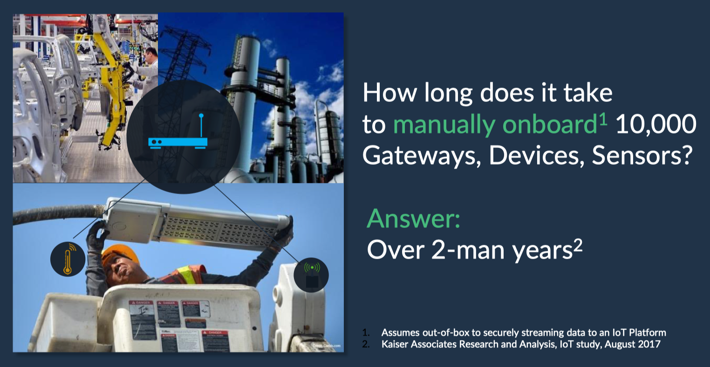
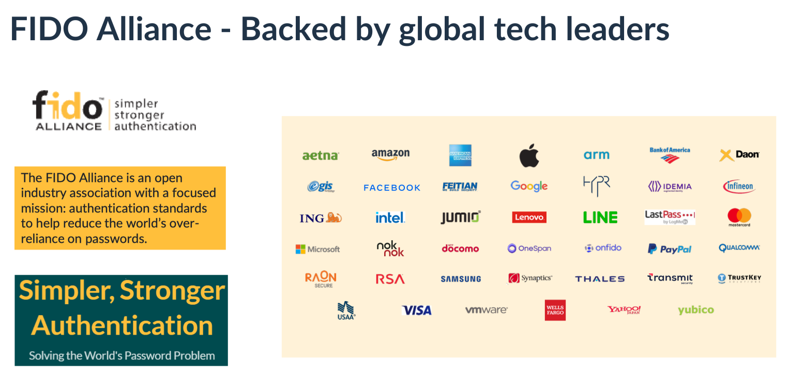
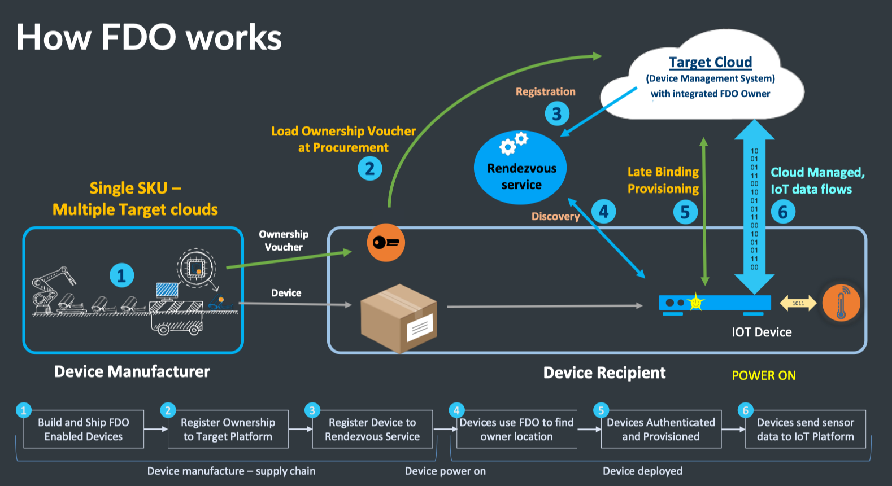
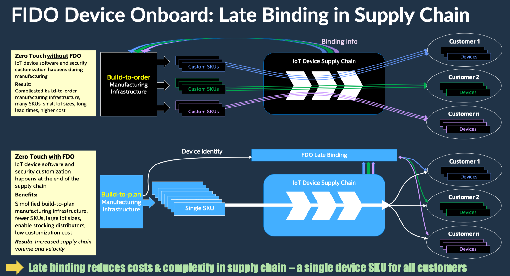

---

Solving the IoT device onboarding problem


On October 21, 2021, Intel delivered three presentations to the delegates at Security Field Day 6. This post focuses on the presentation given by Richard Kerslake and Geoff Cooper, "[FIDO Device Onboard (FDO)](https://techfieldday.com/video/intel-fido-device-onboard-fdo/)," where they talked about securely and cost-effectively deploying Internet of Things (IoT) devices in industrial and enterprise environments.

## The Onboarding Problem

Onboarding IoT devices is a significant challenge in the industry. It is expensive because it can take anywhere from twenty minutes to several hours to deploy a single device. It is insecure because installers often need to know network and application credentials as part of the configuration process.

Adding to the problem is the fact that the world of IoT is massively fragmented. Myriad hardware form factors, operating systems, and processor types deployed across the device spectrum. Some devices have displays, while many do not. Some connect to wireless networks while others attach to wired.

## What are FIDO and FDO?

[FIDO](https://fidoalliance.org/) stands for Fast ID Online and is an industry alliance between global tech leaders (i.e., cloud providers, semiconductor companies, and security companies). Its primary focus is on removing the need for passwords. It was a natural fit for this group to tackle the abovementioned challenges.

FDO stands for FIDO Device Onboard and is a specification created by the FIDO IoT Working Group. After reviewing a set of use cases submitted by its members, the group decided to base FDO on Intel's Secure Device Onboard (SDO) specification.

FDO follows an untrusted model. This model suggests that while the installer may be trusted to be in the building or be a trusted employee, you may not want to trust them with all the network and application credentials. You want them out of the equation for security reasons.

In addition to increasing security, the goals of FDO are to offer flexibility to work with any platform, work seamlessly inside the supply chain (i.e., manufacturers, distributors, and VARs), and create a process that works with IoT re-deployment situations.

## How FDO Works

The FDO concept is built on the foundations of simplicity and security. The ultimate goal is to ship an IoT device to its location, have a semi-skilled resource install and power it up, then have provisioning and onboarding completed automatically and securely.

The FDO process has the following steps:

1. The manufacturer builds a device with embedded credentials. An ownership voucher with embedded credentials is also created. Each set of credentials are cryptographically linked to each other.
2. The device is boxed and shipped to its installation location. At the same time, the ownership certificate is received and processed by procurement. The certificate is loaded on the target cloud that will eventually onboard the device. This cloud can be public or private.
3. The target cloud registers the device to the rendezvous server.
4. The IoT device is powered on and discovers the rendezvous server. The device learns about the location of the target cloud in this step.
5. The device contacts the cloud to complete mutual authentication. Once authenticated, a secure, encrypted channel is set up to transfer keys, settings, and OS upgrades.
6. The device performs its intended operational duties.

## FDO and ZTP

FDO offers many advantages to device deployments compared to manual processes. Frankly, any Zero Touch Provisioning (ZTP) process is a significant improvement over manual methods. The obvious question is: Can FDO improve upon existing ZTP models? The answer is "Yes."

One of the most significant advantages FDO brings to ZTP is the late binding of device configuration and customization. In the traditional ZTP model, the manufacturer provides an SKU for each customer and multiple SKUs for a single customer in many situations. This forces the manufacturer in a build-to-order model where there can be no stock in the supply chain. Using FDO, manufacturers can build their devices and have them in the supply chain closer to their customers (i.e., at distributers and VARs) because configuration and customization occur when the device is provisioned.

FDO also eases the pain of redeployments and resale of used devices. Simply reset a device to factory defaults, repeat the onboarding process with new credentials, and any IoT device can be repurposed.

Rather than being proprietary, FDO is open-source and enjoys support from the [LF Edge Project](https://www.lfedge.org/projects/securedeviceonboard/). Source code is available on [GitHub](https://github.com/secure-device-onboard/).

## All Aboard

The near-term goals of the FIDO Alliance are to drive adoption, work on the certification program, and incorporate additional requirements in future versions of FDO. IoT devices are invaluable across many industries and business settings - including utility, industrial, manufacturing, healthcare, and security. If your duties include managing such devices, positioning FDO as a requirement for your next IoT device evaluation and procurement may decrease your costs while increasing security for your organization.

---
> **Disclosure:** I was invited to participate in XFD6, and this participation is voluntary. While Gestalt IT hosts the event, I am not required to produce this post. It was not reviewed or edited by Gestalt IT or the sponsors of the event.

---
