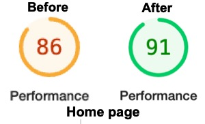
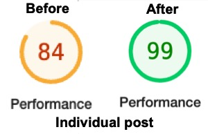

---

In CloudFlare’s kitchen, ingredients stored at GitHub


After five years of hosting this blog on the WordPress platform at my domain registrar, I've recently migrated it to static pages generated by [Hugo](https://gohugo.io). This post describes the new setup and talks about my reasons for switching.

Before I begin, I want to thank WordPress for five years of near-flawless service.

## Reasons

The most common reasons for using a static site generator are **speed**, **security**, and **cost**. Of these three reasons, reducing my costs was the most important. Between hosting charges, certificate costs, and subscriptions for various plugins (i.e., theme, SEO, and social media), blog operations cost approximately $350/year. Nowadays, this doesn't even cover my family's average grocery bill, so it's only a drop in the bucket compared to my other expenses. Still, it seemed excessive for a blog that averages about five posts per year.

I could've reduced costs within the existing system, but that wouldn't have addressed all of my concerns. I will categorize these concerns as annoyances and inconveniences. Every upgrade, whether WP itself or a component like a plugin or the theme, seemed to break minor customizations I made. More often than not, the fix was to reapply the customization. In rare cases, my customizations would need little tweaks before they worked again.

I don't particularly like working in a browser. Call me old, but I prefer using a browser to view stats, dashboards, metrics, and pay bills while using dedicated or specialized tools for creating and outputting content. My workflow for the old system was to create posts in MS Word or Scrivener and then copy/paste them to WP in the browser. I wanted to get away from this manual assembly line.[^tools]

[^tools]: I know there are creation tools that connect to WP.

Lastly, I don't need a full-blown CMS for my blog. WP offers way more than I require.

## The Cafè

Every greasy spoon has the following components:

### Chef: Hugo

[Hugo](https://gohugo.io) is a static site generator and the star of the show. It converts [Markdown](https://en.wikipedia.org/wiki/Markdown) content into HTML files ready to be served by any web server. Dynamic site generators generally need to create a new HTML file for every visitor before the server can transfer it to them. Even though the content of a page might be the same for every user, each receives a newly generated page.[^dynamic] This process takes time. With static sites, HTML pages are rendered once at build time, and every visitor loads the same page. There should be performance gains with the static method, and it pairs nicely with content that doesn't change very often - such as blogs.

[^dynamic]: A caching system for HTML pages was eventually implemented to reduce the frequency of page generations, thereby speeding up page-load times.

Another advantage of static sites is security. Because their web pages are pre-built, there are no calls to external supporting systems while serving the page. The attack surface on backend databases or file systems is significantly reduced or nonexistent.

Hugo requires a [theme](https://themes.gohugo.io) to build the HTML files with your desired style and formatting. After sampling many different ones, I eventually landed on [Mainroad](https://themes.gohugo.io/themes/mainroad/). There are a few things I'd like to tweak, which explains my [WebDev playlist on O'Reilly](https://learning.oreilly.com/playlists/dddcb72e-9766-4eac-a96e-0fa6dda2b243).[^webdev]

[^webdev]: I may need one of you to talk me out of this.

### Pantry: GitHub

Except for images and icons, all files in this system are text-based, which means they can and should be version controlled. The obvious choice here is [Git](https://git-scm.com). I've been using [GitHub](https://github.com) for a few years as a repository for my network automation initiatives, so it was a natural choice to store my blog. I've kept this repo private to avoid issues with search engines detecting duplicate content.

### Kitchen: CloudFlare Pages

There are many options for hosting a blog, and I think I considered most of them. I briefly considered offerings from my domain registrar and email provider. I mulled GitHub Pages and glanced more seriously at the major CSPs. However, my requirements led me to choose between Netlify and [CloudFlare Pages](https://www.cloudflare.com/products/pages/). CloudFlare won that coin toss.

I've granted CF access to the GitHub repo. Upon detecting a new commit, this environment automatically installs Hugo, clones the repo, runs Hugo using the clone as input, and then deploys the resulting HTML pages to web servers. In addition to deploying the website, CF automatically adds and manages a certificate, applies TLS encryption, and redirects all HTTP requests to HTTPS.

### Patrons: You

Welcome to the newly renovated space.

I haven't implemented a commenting system and have no plan to in the future. If you want to discuss anything, blog related or not, using one of the methods listed on [my contact page](/contact/) is the best place to start.

## Reviews

I've significantly reduced my costs as Hugo, GitHub, and CloudFlare Pages with certificate management and TLS encryption are free.

According to my unscientific methods, performance has increased for both the home page as well as individual posts.[^perf]

[^perf]: These are Lighthouse scores. I realize there are more factors than static pages contributing to this performance improvement.

Creation of new posts will use tools and processes I'm already familiar with because of my network automation experience. I've named this new process Blog-as-Code (BaC).[^tm] I used the WP-to-Jekyll plugin to migrate my existing content to markdown files. There remained plenty of raw HTML in each resulting file. Regex-enabled search-and-replace in VS Code made quick work of this cleanup. Migration using the BaC process baked in my mind that this new setup is absolutely the way forward for me and my blog.

[^tm]: Trademark pending.

The icing on the cake was when my friend [Jordan Villarreal](https://twitter.com/SystemMTUOne) pointed out that one of my posts contained a few broken images. A quick update and commit to the post in the local repo, followed by a push to GitHub, and 29 seconds later, the entire site was redeployed.

Overall, I give my new platform and process a ⭐⭐⭐⭐⭐ rating, but I'm biased. Take the self-guided tour, see what you think, and let me know if you find any errors.

**One more thing.** The RSS link for this site has changed as a result of the replatform. If you're a subscriber, please update your favourite feed tool. If you want to subscribe, the link is [https://brunowollmann.com/index.xml](https://brunowollmann.com/index.xml).

Thanks for being here, 
Bruno
