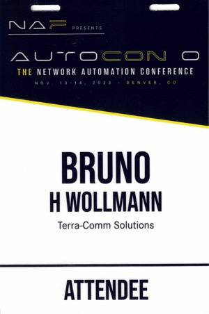

---
The [Network Automation Forum](https://networkautomation.forum) recently hosted the inaugural AutoCon conference, AutoCon 0[^0-based], in Denver, Colorado, to answer **"WHY HAVEN’T WE SEEN FULL ADOPTION OF NETWORK AUTOMATION, YET?"** The question shows optimism for the future of network automation, one of the conference's main themes, and the attitude held by its 300-ish attendees.

[^0-based]: Gotta love the 0-based indexing.

For two days, the conference featured two keynotes, a few presentations to showcase inspirational success stories, panel discussions centered on specific topics, and perspectives from a few vendors. It ended with a working session titled **"Now What?"** Audience participation had been high for all sessions, but this one focused on the audience; it was an open-mic night.

## What Happened

### Keynotes

[John Willis](https://www.linkedin.com/in/johnwillisatlanta/) opened the conference by discussing his experience at the beginning of the DevOps movement, which he helped create. His talk centered on the journey and included successes and failures as software developers and sysadmins collaborated to create better experiences for their customers and the businesses they served. John wanted to convey that networking is not unique, so there is no good reason to lag far behind other disciplines in adopting automation.

[Kireeti Kompella](https://www.linkedin.com/in/kireetikompella/) provided some big-picture thinking for network automation by using examples of the advancements made in the automobile industry. Cars have progressed from 100% operator-controlled to self-driving in limited use cases. Between these two states, there are examples of automation that are very useful with varying degrees of operator control. Cruise control, adaptive cruise control, and lane assist are a few examples. If the networking industry works towards creating self-driving networks[^sdn], whether we get there or not, there will be many benefits by simply embarking on the journey.

[^sdn]: The other SDN.

### Presentations

The presentations offered hope and inspiration by sharing network automation success stories.

Topics included:

- Read-only automation to simplify and accelerate troubleshooting
- Automated deployments across various network types
- Orchestrating network and server deployments
- Integrating observability and monitoring tools
- Automation architectures
- Getting started and how to progress
- Automating service assurance and the network design process[^design]

[^design]: Yes, automation is helpful during network design.

### Panel Discussions

Panels consisted of automation experts led by a moderator. Some panels started with brief presentations, but all consisted of moderator-asked questions and questions from the audience.

Topic included:

- The current state of network automation
- Challenges to adoption
- The role of AI/ML
- Observability
- Lessons from public cloud
- How can we do better

## What Needs To Happen

Here are some items that stood out for me during the conference.

### Find Common Ground

Network automation lacks a clear taxonomy for definitions. What are DevOps, NetDevOps, automation, orchestration, visibility, and observability? At the conference, there was some debate about what each means, how they differ, and where they overlap. Network automation will seem nebulous to the uninitiated until those at the forefront can agree on definitions and clearly articulate their meaning.

Some presenters shared high-level automation architectures; although they had some commonalities, there were also differences. These variations mean that once you progress beyond the most basic automation practices, your architecture is probably a snowflake[^snowflake] and will continue to diverge from all others. Pairing a common lexicon with some reference automation architectures would help lower the barrier to network automation.

[^snowflake]: This may or may not describe the network you're attempting to automate.

Conversations that center on definitions and architectures invariably lead to debates about standards. Our industry might be able to agree on definitions and high-level architectures, but standards for data models and APIs may not be attainable or even desirable. You only have to look as far as SNMP to see an example of a standard that morphed to accommodate every possible vendor use case. YANG is suffering a similar fate. Vendors also need to innovate and differentiate themselves from their competitors, which requires standards to be flexible or risk abandonment.

### Close The Gap Between Build vs Buy

Most of the automation solutions on display were of the DIY variety. Some architectures had a sprinkling of COTS solutions, but open-source combined with home-grown applications performed the bulk of the work. Some presenters mentioned they were DIY because what they needed didn't exist as open-source or as COTS.

There exists a clear opportunity for vendors to provide solutions in the network automation space. One line of thinking is that network automation is so new that many organizations don't know what they need, and open-source software offers a cost-effective way to define and refine requirements. Once automation becomes more widespread, perhaps automation requirements will become second nature, leading to more COTS solutions being developed and purchased.

### Always Be Selling

Network automation needs champions for it to gain traction. SMEs should be selling the benefits vertically and horizontally inside their organizations. Benefits must be directly related to business outcomes to expect support from managers and senior leaders. ICs must feel safe, secure, and included when faced with new ways to implement and operate their networks.

It starts by sharing everything: scripts, programs, thoughts, ideas, and knowledge. Move scripts from individual laptops to shared repositories; bonus points if the repo has version control. Create a safe space for learning and adapting - there are no dumb questions.

### Strive For A Digital Twin

A lab environment is a crucial ingredient for a safe learning space. It's also an essential element in building and testing automation systems. Creating a digital twin of your network was discussed as the ultimate goal, as it should allow checking state changes caused by configuration changes. Although it's nearly impossible to recreate all network states, combining physical and virtual gear will probably get you to *good enough*.

### Handle The Truth

All data that goes into a network's configuration must be stored somewhere and be accessible programmatically. Some call this storage system a source of truth, while others call it a database. Treating this data as a first-class citizen means the network should not be the database, nor should a set of spreadsheets.

## What Happens Next

AutoCon 0 was a great experience. At approximately 300 people, it offered the right mix of intimacy and a broad spectrum of expertise. Everyone I talked to had their ah-ha moment where they knew they could take something back to their day job and apply it. Although this conference was preaching to the choir, there was a sense of rejuvenation and increased vigor for their automation efforts. There was a feeling that now is the time for automation to come out of the shadows.

When asked for suggestions on how to best progress with automation, some responses from presenters and panelists were "Do or do not, there is no try" or "Shut up and automate." Because success is infectious, maybe the Nike method is the best, "Just do it!"

