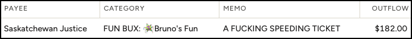
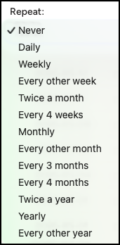

---

I love doing money like this


I used to be bad at money.

I've never been in financial trouble, but I also never really felt like I had a good handle on my finances. I've never been weighed down by consumer debt, but I've also never felt prepared for an emergency. I've been smart enough to save for my eventual retirement, but financing my day-to-day life was entirely reactive. If a big vehicle expense came up, I'd put it on the credit card and find the money later. Something in the house needed replacing; put it on the card and find the money later. Time for a holiday; charge it and pay later. I haven't carried a balance on a credit card since I was in my 20s, but sometimes "find the money later" meant paying the credit card with the Home Equity Line of Credit (HELOC). I've rolled this HELOC into a mortgage renewal at least twice.

I could have been better with my money, but I didn't know what "better" meant. My parents didn't have much money, and, like politics, never discussed finances with the family. Personal finances weren't part of the education curriculum. Once my career started, my spare time went to being a dad, playing sports, and becoming a better [Network]() [Architect]().

My priorities changed several years ago when the topic of home renovations came up. The last time the HELOC was rolled into the mortgage, the balance covered home renovation expenses that went way over budget. I was scared another round of renovations would end the same way: over-budget and back-stopped by extending the mortgage. My focus and spare time suddenly shifted to learning about personal finance so I could stop using the HELOC as a second income.

## The YNAB Way

I needed a plan for my money and to learn how to create one. Internet searches led me to a few personal finance blogs that told me I needed a budget. A common subject across many blogs and finance articles was the various budgeting methods and the software solutions that implemented them. I was expecting to find different budgeting templates for Excel, but I found so much more.

I eventually decided to use [YNAB](https://www.ynab.com). The [method](https://www.ynab.com/ynab-method), combined with all the resources to get me started and keep me going, was the deciding factor. Learning the method and software was easy because my brain instantly recognized similarities to networking concepts. YNAB stands for You Need A Budget, but I call it the Money Router.

[YNAB](https://ynab.com/referral/?ref=Y5iyxaPqWrGjP7oj&sponsor_name=Bruno&utm_source=customer_referral) has a single main concept: **give every dollar a job**. The key thing to remember about this concept is that it only applies to the dollars you currently have. Just like a router only makes routing decisions on traffic that has entered an interface, you can't give a job to money you don't have.

A router uses various lookup tables to decide the egress interface for the traffic it sees. It immediately routes all new traffic as it arrives and only sits idle between bursts of traffic. Similarly, the Money Router delivers the best results when your money's employment rate is 100%. A set of five questions decides the vocation for each dollar.

### Reality

**What does this money need to do before I'm paid again?**

The **REALITY** is, we all have weekly or monthly expenses such as groceries, housing, utilities, fuel, phone, and Internet. Funding these categories should take the highest priority each month. If you're a network person, categories in the reality section are your most specific routes in the Money Router; the Longest Prefix Match (LPM) algorithm routes traffic to these categories first if they are not yet full.

### Stability

**What larger, less frequent spending do I need to prepare for?**

**STABILITY** comes from being prepared for non-monthly expenses. These expenses (i.e., vehicle and home maintenance, vehicle and home insurance, summer camps, birthdays, anniversaries, Christmas, new phones, and new computers) always snuck up on me. I now treat them like monthly expenses by routing a little money to them each month.

By December, when Christmas rolls around, money has been accumulating since January, preventing the stress of the subsequent credit card statement. Every September, I have enough money saved to buy a nice anniversary present for my wife. The bonus is that, because of YNAB, I remember to.

### Resilience

**What can I set aside for next month's spending?**

If you've filled all your categories for the current month and still have unemployed dollars, congratulations! You have some **RESILIENCE** and can take advantage by employing this money in the future. Covering some of next month's expenses feels great. Covering all of next month's expenses is life-changing. YNAB calls this "being a month ahead," and it should be your goal. Being a month ahead means you're living on last month's income and no longer have to match paycheques to certain expenses. When you're a month or more ahead, paydays and billing dates don't matter.

As long as you spend less than you earn, you will get a month ahead. The gap between spending and earning determines how long it takes to get there. If you have a variable income, as I do, you should consider getting more than a month ahead. This gives you some breathing room by smoothing your income.

### Creation

**What goals, large or small, do I want to prioritize?**

**Creation** breathes life into something that is important to you. The Wollmanns love our family adventures, so our **🛂🛃Adventures** category hires new employees monthly.

Goals are very personal, and many need at least some money to be realized. Maybe you want to travel more. Maybe you want to go back to school. Define your goals and start funding them.

### Flexibility

**What changes do I need to make, if any?**

**Flexibility** is where my routing analogy breaks down. In networking, rerouting the same traffic usually indicates a routing loop and a broken network. In YNAB, reassigning money simply means your priorities have changed, requiring a new career for some of that money.

Perhaps your vehicle needs a major repair, and there isn't enough money in the auto maintenance category. Maybe your nephew is getting married on the other side of the world, and the travel category is depleted. It's your money, and the budget isn't written in stone. Reassign your money without stress or guilt, and cover those expenses.

Maybe you don't need to move money, but it's still an unexpected expense.

## Key Features

YNAB has many great features. Here are a few of my favourites.

### YNAB Together

With YNAB together, you can share your subscription with up to 5 other people. Each member can create their own plan and share it with any of the other group members. However, the subscription owner automatically has access to all other plans. This has been helpful as I introduce my kids to YNAB.

> [!NOTE]
> The "B" in YNAB stands for "budget," but within the software, the term "budget" was recently replaced with "plan."

My wife and I share a family plan and a business plan since we both have businesses to run. Our kids join the family economy and the YNAB subscription when they're eight years old. One of our kids has her own plan that my wife and I can access, but she can't access our plans.

We have two more kids to introduce in the next few years.

### Unlimited Plans

You can create an unlimited number of plans inside your subscription, which works great with YNAB Together. This feature allows some experimentation and compartmentalization without messing up your main plan. Fresh starts create snapshots of a plan before zeroing them out. This allows you to reference old plans for historical data.

### Credit Card Management

Have you ever heard of the "credit card float?" You're floating when you don't have enough money in the bank to pay the balance and cover all your expenses before the next paycheque arrives. Not floating means you can pay your CC balance at any time without worry.

One of my favourite features is how credit cards and their payments are managed. Whenever you use your credit card for a purchase, the money is moved from its assigned category to the credit card payment category. Basically, the CC is treated like a debit card. No risk of missed payments or an accumulating balance.

### Scheduled Transactions

You have the ability to connect YNAB to your bank accounts to help automate financial record-keeping. I tried this feature for a few months and didn't like it. Instead, we opted to enter all transactions - inflows and outflows - manually.

Although manual entry is not particularly burdensome, I rely heavily on scheduled transactions to automate transaction entry. I use this feature for both one-offs and recurring transactions. The 13 repeat options are displayed below.

YNAB displays each account's running balance. Using scheduled transactions also allows you to view future balances.

### Reflect

YNAB has a space to reflect on your financial journey. The information provided here can be used to evaluate if changes to the plan are needed. It answers questions like:

- Is my net worth increasing as fast as I would like?
- Should I increase/decrease spending in any particular category or category group?
- Why are kids so expensive?

### Tracking Accounts

Tracking accounts hold money you don't plan to spend soon. As such, the funds in these accounts are off-budget and don't get jobs. YNAB uses their value to calculate net worth in the Reflect section, which I find useful. I track our various retirement accounts and our kids' Registered Education Savings Plans (RESP). I also use this feature to track the value of our house to gain a more complete picture of our net worth. The older I get, the more important this number is to me.

## How We YNAB

My wife and I are completely into YNAB, so we YNAB almost every day. Yes, YNAB is a noun and a verb.

Shortly after subscribing to YNAB, we decided to combine all of our finances. After all, we created kids together, and we committed our futures to each other. Having joint bank accounts seemed like a comparatively small commitment and a good idea. I'm happy to report that it was definitely a good idea.

As mentioned earlier, we enter all our transactions manually and remain very disciplined in this approach. As the main YNABer, I handle the other tasks required to configure and maintain our money router and have incorporated them into my morning routine. I confirm transactions and reconcile our accounts daily, which takes about three minutes. Routing money between and within our corporate and personal accounts takes about 15 minutes per month. The monthly rollover also takes about 15 minutes, since there are many more transactions and a few other items to handle on the first of each month.

We conducted meetings pretty regularly when we first started YNAB. We used an agenda to stay focused and to create a plan that we thought would work for us. Once we had a good understanding of the YNAB method, how the software worked, and our goals, we scaled back to monthly meetings. We've been doing this long enough that we scrapped the regular meetings and just talk freely about money whenever one of us brings it up.

## Transmogrification

I am now really good with money.

Credit card float, HELOC, and overdraft protection are no longer part of my vocabulary. They have been replaced by **give every dollar a job** and **find the money first**. Sticking to those two principles has made my money boring because I'm no longer constantly moving money between accounts. Once routed, my money just sits there waiting to be spent, guilt-free and worry-free. I've gone from knowing my account balances and hoping there was enough, to knowing what each dollar in those accounts is meant for.

My kids start learning these fundamentals by joining the family economy when they're eight. It's a big deal in our family because that's when they open a bank account, gain access to [YNAB](https://ynab.com/referral/?ref=Y5iyxaPqWrGjP7oj&sponsor_name=Bruno&utm_source=customer_referral), get an email address, learn to use a password manager, and get paid for doing chores.

If you're looking to change how you do money, give [The Money Router](https://ynab.com/referral/?ref=Y5iyxaPqWrGjP7oj&sponsor_name=Bruno&utm_source=customer_referral) a try. There's a 34-day free trial; no credit card required.

---
> **Disclosure:** I am not affiliated with YNAB and was not paid to write this post. However, some of the links in this post are part of YNAB's referral program. Every subscriber automatically receives a referral link. If you subscribe to YNAB using [my link](https://ynab.com/referral/?ref=Y5iyxaPqWrGjP7oj&sponsor_name=Bruno&utm_source=customer_referral), we each earn a free month. [Here it is again in case you missed it 😉](https://ynab.com/referral/?ref=Y5iyxaPqWrGjP7oj&sponsor_name=Bruno&utm_source=customer_referral).

---
